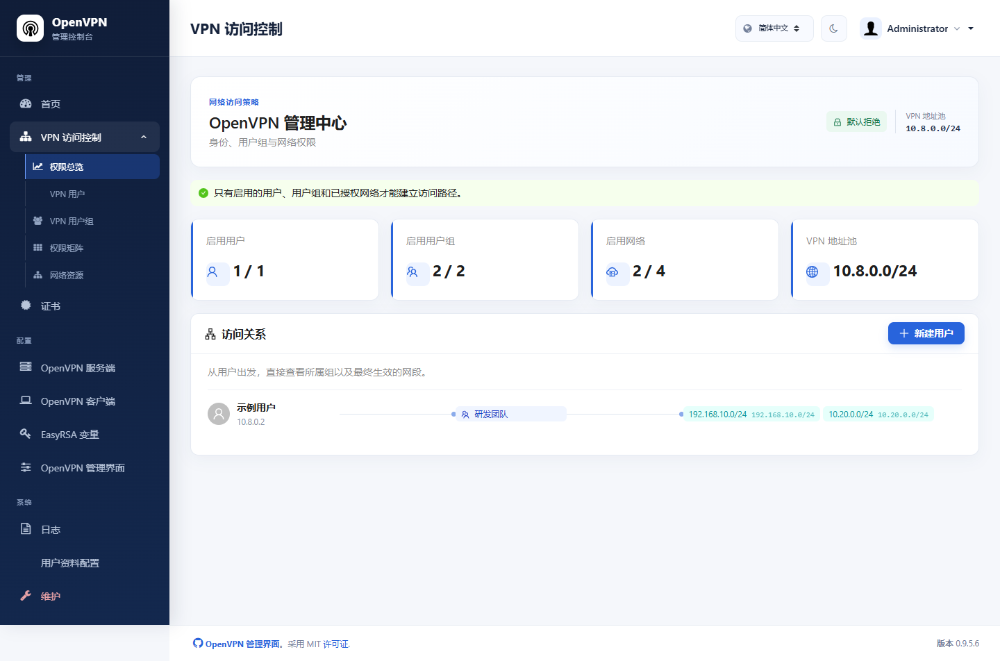
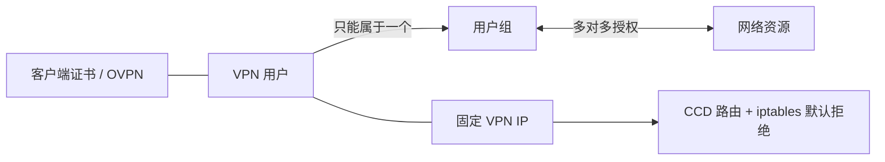
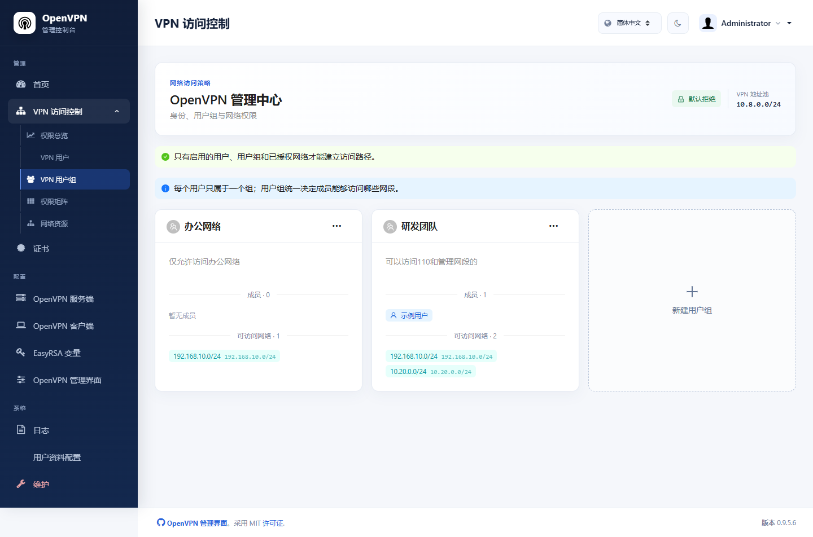
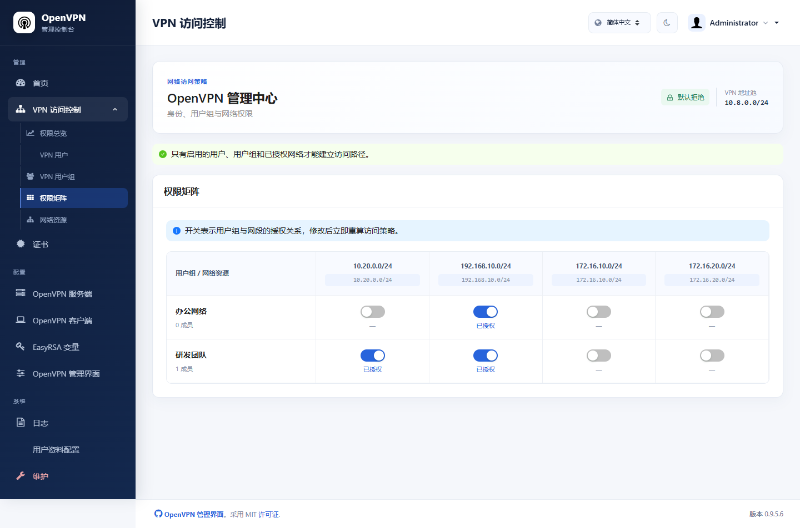

# OpenVPN UI（增强版）

一个面向个人、家庭实验室和中小型团队的 OpenVPN Web 管理平台。

本项目基于 [d3vilh/openvpn-ui](https://github.com/d3vilh/openvpn-ui) 持续改造，保留 OpenVPN、EasyRSA、证书与运行状态管理能力，并增加了现代化中英文界面、证书用户管理、固定 VPN IP、用户组网段授权和默认拒绝访问控制。项目可以通过 Docker 部署在 Linux 服务器及基于 Linux 内核的 NAS 上。

[](LICENSE)
[](#docker-部署)
[](https://openvpn.net/)



## 项目特色

- **证书即身份**：一个 VPN 用户对应一个客户端证书和一份 `.ovpn` 文件，导入后无需再输入 VPN 用户名和密码。
- **固定 VPN IP**：可以自动分配或手工指定用户的 VPN 地址，并通过 CCD 配置持久生效。
- **用户组授权**：一个用户只属于一个用户组，一个用户组可以包含多个用户。
- **多网段权限**：用户组和网络资源是多对多关系，可以用权限矩阵快速调整授权。
- **默认拒绝**：只有启用的用户、启用的用户组和明确授权的网络才能形成访问路径；未授权流量由宿主机防火墙拦截。
- **网络自动发现**：从 Linux 宿主机路由表发现可用网段，也支持手工新增 IPv4 CIDR。
- **证书全生命周期**：支持生成、下载、续签、禁用、吊销和删除；变更策略时会立即断开对应会话。
- **现代管理界面**：使用 React、TypeScript 和 Ant Design 重构访问控制功能，并与现有后台整合在同一套导航和页面布局中。
- **中英文界面**：登录页、导航、配置页和访问控制页支持 English / 简体中文即时切换。
- **客户端兼容性**：生成的配置可导入 OpenVPN Connect，也兼容群晖 DSM 内置 OpenVPN 客户端。
- **TCP 默认配置**：默认使用 TCP，也可以在部署配置中切换为 UDP。
- **Docker 一体化部署**：初始化、OpenVPN 服务端和管理界面使用同一镜像，通过 Docker Compose 编排。

项目同时保留上游已有的 OpenVPN 服务端配置、客户端模板、EasyRSA、证书、日志、连接状态、2FA 和后台用户管理功能。

## 访问控制模型



权限同时在两层生效：

1. OpenVPN CCD 只向客户端推送所属用户组获准的路由。
2. 服务端根据固定 VPN IP 生成 `iptables` 规则。即使客户端自行添加路由，未授权流量仍会被拒绝。

### 用户组与网络



### 权限矩阵



> 截图来自实际部署环境，用户名称、证书 CN 和内网地址已替换为演示数据。

## Docker 部署

### 运行要求

- Linux 服务器，或群晖等基于 Linux 内核的 NAS。
- Docker Engine 和 Docker Compose v2。
- 主机存在 `/dev/net/tun`。
- 主机能够访问 VPN 用户需要连接的目标内网。
- 允许容器使用 `NET_ADMIN` 和 `host` 网络模式。

生产部署不支持 Windows 容器模式。Windows 可以用于拉取源码、构建镜像和维护项目。

### 使用预构建镜像

仓库的 `docker/` 目录包含可以直接使用的 Compose 配置，默认拉取：

```text
www.durian.fun:32433/openvpn-ui:v0.4
```

部署步骤：

```bash
git clone https://github.com/tyy202/openvpn-ui.git
cd openvpn-ui/docker

cp .env.example .env
chmod 600 .env
nano .env

test -c /dev/net/tun || sudo modprobe tun
sudo sysctl -w net.ipv4.ip_forward=1

docker compose config --quiet
docker compose pull
docker compose up -d
```

首次启动会创建数据库、CA、服务端证书和 DH 参数，耗时可能较长。初始化容器正常完成后应显示 `Exited (0)`：

```bash
docker compose ps -a
docker compose logs -f init
docker compose logs --tail=100 openvpn openvpn-ui
```

部署包含三个服务：

| 服务 | 作用 |
| --- | --- |
| `init` | 首次创建数据库、OpenVPN 配置、CA 和服务端证书，完成后退出 |
| `openvpn` | 运行 OpenVPN 服务端，使用 TUN 设备和 `NET_ADMIN` 权限 |
| `openvpn-ui` | 提供管理后台，并维护证书、CCD 和访问控制规则 |

`openvpn` 和 `openvpn-ui` 使用 `network_mode: host`，从而读取宿主机路由，并在相同网络命名空间中执行访问控制。

### 必要配置

编辑 `docker/.env`：

```dotenv
OPENVPN_IMAGE=www.durian.fun:32433/openvpn-ui:v0.4

OPENVPN_PUBLIC_HOST=vpn.example.com
OPENVPN_PUBLIC_PORT=1194
OPENVPN_PROTOCOL=tcp

OPENVPN_VPN_CIDR=10.8.0.0/24
OPENVPN_LAN_CIDR=192.168.18.0/24
OPENVPN_NAT_INTERFACE=

OPENVPN_ADMIN_USERNAME=admin
OPENVPN_ADMIN_PASSWORD=CHANGE_ME_USE_A_LONG_RANDOM_PASSWORD

UI_BIND_IP=0.0.0.0
UI_PORT=8080

OPENVPN_UI_NETWORK_SCOPES=
```

| 配置项 | 说明 |
| --- | --- |
| `OPENVPN_IMAGE` | 要拉取的项目镜像和版本 |
| `OPENVPN_PUBLIC_HOST` | 客户端实际连接的公网 IP 或域名，不要包含协议和端口 |
| `OPENVPN_PUBLIC_PORT` | OpenVPN 对外端口；需要在防火墙、路由器或内网穿透中转发 |
| `OPENVPN_PROTOCOL` | `tcp` 或 `udp`，默认 `tcp` |
| `OPENVPN_VPN_CIDR` | VPN 客户端地址池；当前固定 IP 功能要求使用 `/24` |
| `OPENVPN_LAN_CIDR` | 首次初始化使用的目标内网，后续可在 Web 后台维护多个网段 |
| `OPENVPN_NAT_INTERFACE` | 可选的 NAT 出口接口；留空时对宿主机路由接口应用 NAT |
| `OPENVPN_ADMIN_USERNAME` | Web 管理后台的初始管理员用户名 |
| `OPENVPN_ADMIN_PASSWORD` | Web 管理后台的初始密码，至少 12 个字符 |
| `UI_BIND_IP` | 管理后台监听地址；`0.0.0.0` 表示允许通过主机网络访问 |
| `UI_PORT` | 管理后台端口，默认 `8080` |
| `OPENVPN_UI_NETWORK_SCOPES` | 可选的后台账号网段作用域；留空保持原管理员全权限行为 |
| `ALLOW_USER_MANAGEMENT` | 是否允许管理员创建和管理其他后台账号，默认 `false` |

VPN 地址池不能与目标内网、Docker 网络或客户端所在地网络重叠。含 `$`、`#` 等字符的密码建议使用单引号包裹：

```dotenv
OPENVPN_ADMIN_PASSWORD='your-long-random-password'
```

地址池、初始网段和初始管理员变量主要用于首次初始化。数据库创建后，修改这些值不会覆盖后台中已经保存的账号和配置；监听地址和账号网段作用域则会在 `openvpn-ui` 容器每次启动时读取。

### 按后台账号限制网段

`OPENVPN_UI_NETWORK_SCOPES` 可以让多个后台账号只看到和管理分配给自己的网段。账号名对应“用户资料配置”中创建的登录名，匹配时不区分大小写：

```dotenv
OPENVPN_UI_NETWORK_SCOPES=admin=*;office-admin=192.168.18.0/24,10.32.22.0/24;branch-admin=172.16.10.0/24
```

- `admin=*` 表示该账号可以查看和管理全部网段。
- `office-admin` 只能看到两个指定网段，以及权限完全位于这两个网段内的用户组和 VPN 用户。
- `branch-admin` 只能看到 `172.16.10.0/24`。
- 未列出的后台账号不能进入“VPN 访问控制”。
- 跨越可见和隐藏网段的混合用户组不会展示给窄权限账号，避免间接授予隐藏网段。
- 只有 `*` 全权限账号可以执行“发现主机网络”；窄权限账号仍可手工新增其白名单中的 CIDR。

变量留空时保持向后兼容：管理员可以管理全部网段，普通后台账号不能进入访问控制。配置非空后，它会成为访问控制页面的账号白名单，所以应始终为主管理员保留 `admin=*` 或对应的实际登录名。

修改作用域后只需重建 `openvpn-ui` 容器，不需要重新初始化 CA 或数据库：

```bash
docker compose up -d --force-recreate openvpn-ui
```

### 后台账号管理

默认情况下，所有后台账号在“用户资料配置”中都只能编辑自己的姓名、邮箱和密码。需要由管理员创建、查看、编辑或删除其他后台账号时，在 `.env` 中显式启用：

```dotenv
ALLOW_USER_MANAGEMENT=true
```

该开关只向管理员开放用户管理功能，普通账号即使启用开关也仍然只能编辑个人资料。修改后执行 `docker compose up -d --force-recreate openvpn-ui` 使配置生效。

## 使用流程

1. 打开 `http://Linux主机地址:8080` 并使用 `.env` 中的管理员账号登录。
2. 在“OpenVPN 客户端”中确认公网连接地址、端口和协议。
3. 展开“VPN 访问控制”，进入“网络资源”，发现宿主机网络或手工新增 IPv4 CIDR。
4. 启用需要管理的网络资源。
5. 创建用户组，并在组编辑界面或权限矩阵中选择允许访问的网段。
6. 创建 VPN 用户、选择用户组，并选择自动分配或手工填写固定 VPN IP。
7. 下载 `.ovpn` 文件并导入 OpenVPN Connect、群晖 DSM 或其他兼容客户端。

“VPN 访问控制”是一个可折叠菜单，总览、VPN 用户、用户组、权限矩阵和网络资源都在同一个管理页面内切换。

### 用户状态与证书操作

- **禁用**：阻止用户建立连接，移除访问规则，并断开当前会话。
- **启用**：恢复当前证书和用户组策略。
- **续签**：签发新证书、吊销旧证书并断开当前会话；用户需要重新下载 `.ovpn`。
- **删除**：断开连接、吊销证书、更新 CRL、删除 CCD 和客户端文件，并释放固定 VPN IP。

## 从源码构建镜像

镜像构建上下文必须使用仓库根目录，因为构建过程会同时编译 Go 后端和 `web/` 中的 React 前端：

```bash
docker buildx build \
  --platform linux/amd64 \
  -t your-registry.example.com/openvpn-ui:v1.0.0 \
  --push .
```

需要在本机试运行时：

```bash
cp .env.example .env
nano .env
docker compose up -d --build
```

根目录的 `compose.yaml` 会构建本地镜像；`docker/docker-compose.yml` 会拉取 `OPENVPN_IMAGE` 指定的在线镜像。

## 更新

使用预构建镜像：

```bash
cd openvpn-ui/docker
docker compose pull
docker compose up -d
docker compose ps -a
```

从源码部署：

```bash
git pull
docker compose up -d --build
docker compose ps -a
```

更新前建议备份 `.env` 和 `data/`。不要通过删除 `data/` 升级，否则会丢失 CA、管理员账号、证书和客户端配置。

## 数据与备份

运行数据保存在部署目录的 `data/` 中：

```text
data/
├── db/                         # 管理账号、网络资源和访问策略数据库
├── log/                        # OpenVPN 日志和连接状态
└── openvpn/
    ├── server.conf             # OpenVPN 服务端配置
    ├── clients/                # 生成的客户端配置
    ├── config/                 # 客户端模板和 EasyRSA 参数
    ├── staticclients/          # CCD、固定 IP 和用户状态
    └── pki/                    # CA、证书、私钥、CRL 和 TLS 密钥
```

备份示例：

```bash
docker compose stop
sudo tar -czf "openvpn-backup-$(date +%Y%m%d-%H%M%S).tar.gz" .env data
docker compose up -d
```

`data/openvpn/pki/private` 包含 CA 和客户端私钥，备份文件必须保存在受控位置。

## 网络与排错

默认需要开放：

| 端口 | 协议 | 用途 |
| --- | --- | --- |
| `${OPENVPN_PUBLIC_PORT}` | TCP 或 UDP | OpenVPN 客户端连接，由 `OPENVPN_PROTOCOL` 决定 |
| `${UI_PORT}` | TCP | Web 管理后台，只应向可信管理网络开放 |

OpenVPN 管理接口仅通过宿主机回环地址 `127.0.0.1:2080` 使用。

常用检查命令：

```bash
docker compose ps -a
docker compose logs -f openvpn openvpn-ui
docker compose exec openvpn iptables -t nat -S
docker compose exec openvpn-ui iptables -S OPENVPN_UI_FORWARD
docker compose exec openvpn-ui iptables -S OPENVPN_UI_INPUT
```

VPN 可以连接但无法访问目标网络时，依次检查：

1. Linux 宿主机本身是否能访问目标地址。
2. VPN 地址池是否与客户端本地网络、目标网络或 Docker 网络重叠。
3. 用户、用户组和网络资源是否都已启用。
4. 用户组是否已在权限矩阵中获得目标网络授权。
5. 目标设备防火墙是否允许来自 VPN 宿主机的流量。
6. 云安全组、路由器或内网穿透是否按正确协议转发了 OpenVPN 端口。

更完整的部署和排错说明见 [Linux Docker 部署文档](docs/docker-deployment.zh-CN.md)，中英文界面的维护方式见 [中英文界面维护说明](docs/bilingual-ui.md)。

## 安全说明

- 管理后台不建议直接暴露到公网。
- 首次启动后应立即修改示例管理员密码。
- Docker socket 即使以只读方式挂载仍具有较高权限，只应向可信管理员开放后台。
- `.ovpn` 文件通常包含客户端私钥，应按敏感凭据保管。
- 删除或续签用户会吊销旧证书；客户端必须重新下载最新配置。

## 项目关系与致谢

本项目基于 [d3vilh/openvpn-ui](https://github.com/d3vilh/openvpn-ui) 开发；上游项目源自 Adam Walach 的 [OpenVPN-WEB-UI](https://github.com/adamwalach/openvpn-web-ui)。感谢原项目作者及所有贡献者提供的基础实现。

当前仓库已经加入独立的部署、访问控制、前端界面和兼容性改造。提交问题时，请先确认问题是否出现在本仓库的最新版本中。

## 许可证

本项目使用 [MIT 许可证](LICENSE)。使用、修改或重新分发前，请同时检查 OpenVPN、EasyRSA、容器基础镜像和其他依赖组件各自的许可证。
